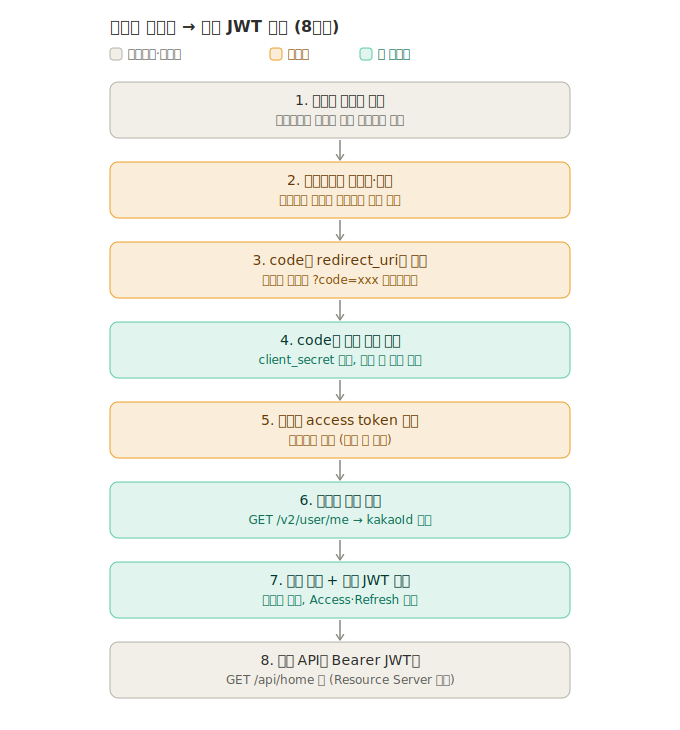

> 생성: 2026-07-16 00:50 · 최종 수정: 2026-07-16 00:50

# ADR-0001: 카카오 인증에 oauth2Login 채택

- **상태**: Accepted
- **결정일**: 2026-07-15

## 맥락 (Context)
카카오 소셜 로그인(Authorization Code)을 구현해야 하고, 과제는 Spring Security의 **OAuth2 Client + Resource Server**를 모두 요구한다. 카카오 로그인 흐름(리다이렉트 → code 수신 → 토큰 교환 → 사용자 정보 조회 → 자체 JWT 발급)을 어떻게 구현할지 결정이 필요했다.

전체 흐름:

## 검토한 후보 (Candidates)
- **후보 A — `oauth2Login` 사용**: Spring이 로그인 흐름(1~6단계)을 자동 처리하고 필터 엔드포인트를 자동 등록. 설정 위주라 코드가 적고 idiomatic. 대신 흐름이 프레임워크에 숨겨짐.
- **후보 B — 수동(RestClient 직접 호출)**: 카카오 토큰/사용자정보 엔드포인트를 직접 호출. 흐름이 코드에 그대로 드러나 학습엔 좋지만 코드량이 많고 관례적이지 않음.

## 결정 (Decision)
**후보 A(`oauth2Login`)를 채택.** 과제가 요구하는 "OAuth2 Client + Resource Server"를 가장 교과서적으로 충족하고, 평가·유지보수에 유리하다. (흐름 이해는 위 다이어그램으로 대체)

- Spring 자동 엔드포인트: `GET /oauth2/authorization/kakao`(로그인 시작), `GET /login/oauth2/code/kakao`(code 콜백).
- 커스텀 **`OAuth2UserService`** — 카카오 사용자 정보 → `users` 조회/가입.
- 커스텀 **`AuthenticationSuccessHandler`** — 인증 성공 시 자체 JWT 발급.
- 카카오는 표준 OIDC가 아니므로 provider를 `application.yml`에 커스텀 명시.

## 결과 (Consequences)
- 로그인 관련 컨트롤러를 직접 만들지 않음(토큰 교환·유저조회는 Spring이 처리).
- 대신 `application.yml` 카카오 설정 + `OAuth2UserService` + `AuthenticationSuccessHandler` 구현이 필요.
- 로그인은 OAuth2 Client, 이후 `/api/*` 보호는 Resource Server(JWT 검증)로 분리 동작.
