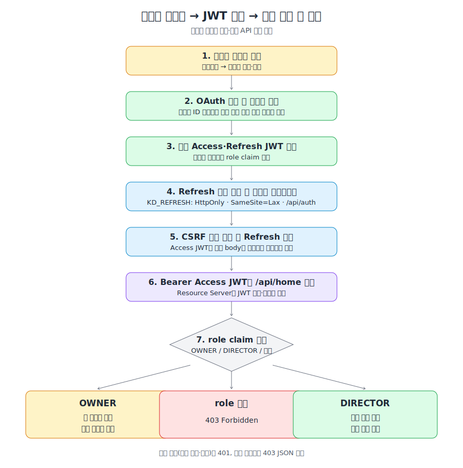

> 생성: 2026-07-16 16:48 · 최종 수정: 2026-07-16 16:56

# 제출 가이드 — 인증·권한 API

본 문서는 반려견 유치원 인증·권한 API 사전과제의 구현 범위와 검증 근거를 정리한 제출 문서이다. 세부 설계 근거와 전체 API 명세는 연결한 참조 문서에서 확인할 수 있다.

## 요구사항 충족 근거

| 요구사항 | 구현 및 확인 위치 |
|---|---|
| 카카오 Authorization Code 로그인·최초 가입 | Spring Security `oauth2Login`, 사용자 조회·생성, OAuth 성공 handler. 흐름과 선택 근거는 [아키텍처 개요](architecture-overview.md), [ADR-0001](ADR/0001-oauth2login.md)에 있다. |
| 자체 Access/Refresh JWT 발급·검증 | Access는 Bearer 헤더, Refresh는 `KD_REFRESH` HttpOnly 쿠키로 전달한다. 만료·서명 검증, refresh 회전, 로그아웃 무효화 전략은 [ADR-0003](ADR/0003-jwt-refresh-strategy.md), [ADR-0009](ADR/0009-bearer-access-refresh-cookie.md)를 참조한다. |
| 역할 온보딩 | 최초 로그인 사용자는 role 없이 생성되며 `POST /api/auth/signup/role`로 `OWNER` 또는 `DIRECTOR`를 한 번 확정한다. 근거는 [ADR-0002](ADR/0002-role-onboarding.md)에 있다. |
| 동일 홈 API의 역할별 분기 | `GET /api/home`은 JWT의 `role` claim에 따라 견주/원장용 더미 데이터를 다르게 반환한다. 역할이 없으면 403이다. 응답 예시는 [아키텍처 개요](architecture-overview.md#-get-apihome-응답-예시)를 참조한다. |
| 기술 스택·실행·환경변수 | [기술 스택 및 실행 방법](tech-stack.md), [README](../README.md)를 참조한다. Java 21, Spring Boot 3.3.x, Gradle 8.x, MySQL 8.0을 사용한다. |
| LLM 활용·검증 기록 | [LLM 활용 기록](llm-usage.md)에 작업별 활용 내용과 검증 방법을 남긴다. |

## AI 활용 방식

AI는 코드 생성 도구로만 사용하지 않고, 요구사항 분석부터 문서화·검증까지의 개발 과정에 활용하였다. 생성·수정된 결과는 테스트와 코드 리뷰를 통해 확인하였다.

| 활용 단계 | 활용 내용 | 검증·통제 방식 |
|---|---|---|
| 요구사항 분석 | 과제 요구사항을 구조화하고, 카카오 로그인·JWT·역할 분기 중 구현 우선순위를 정하는 데 활용하였다. | [과제 정보](assignment_information.md) 및 이슈 단위 작업 계획과 대조하였다. |
| 작업 규칙·문서 체계 | `CLAUDE.md`에 개발 규칙과 문서 인덱스를 두고, 필요 시 `docs/`의 ADR·아키텍처·실행 문서를 참조할 수 있도록 구성하였다. | 문서 간 링크와 실제 패키지·API 정책의 일관성을 확인하였다. |
| 문서 동기화 자동화 | Claude 훅을 구성하여 커밋 또는 PR 생성 전에 ADR, LLM 활용 기록, 문서 시간정보의 갱신 여부를 확인하도록 하였다. | 문서화 누락을 커밋 이전 단계에서 점검하도록 운영하였다. |
| 구현·테스트 | 구현 초안 작성과 TDD의 RED→GREEN 반복에 AI를 활용하였다. JWT, refresh 회전, CSRF, 역할별 홈 응답을 단위·통합 테스트로 구현하였다. | Java 21 환경에서 Gradle 테스트를 실행하고, 토큰 만료·서명 위조·권한 분기 등의 회귀 테스트를 확인하였다. |
| PR 전 코드 리뷰 | PR 생성 전 별도 에이전트에게 코드 리뷰를 요청하여, 구현 과정의 문맥에 의존하지 않는 관점에서 보안·정합성·유지보수성을 점검하도록 하였다. | 리뷰 의견을 반영한 뒤 테스트를 다시 실행하고 PR에 검증 결과를 기록하였다. |

## 전체 인증·인가 흐름



위 그림은 카카오 로그인 이후 Refresh 쿠키 설정, Access JWT 복원, Bearer 검증, 역할별 홈 응답까지의 전체 경로를 나타낸다. 카카오 OAuth 내부 8단계는 [OAuth 흐름도](images/kakao-oauth-flow.svg)에서 별도로 확인할 수 있다.

## API 명세 요약

모든 직접 구현 API는 공통 응답 구조를 사용한다.

```json
{ "code": "SUCCESS", "message": "...", "data": {} }
```

| 메서드 | 경로 | 용도 | 인증·보호 |
|---|---|---|---|
| GET | `/oauth2/authorization/kakao` | 카카오 로그인 시작 | 브라우저 |
| POST | `/api/auth/signup/role` | 역할 확정 및 토큰 재발급 | Bearer Access JWT + CSRF |
| GET | `/api/auth/csrf` | unsafe 요청용 CSRF 토큰 발급 | 공개 |
| POST | `/api/auth/refresh` | refresh 검증·회전 후 Access JWT 발급 | `KD_REFRESH` 쿠키 + CSRF |
| POST | `/api/auth/logout` | refresh DB 무효화·쿠키 삭제 | `KD_REFRESH` 쿠키 + CSRF |
| GET | `/api/home` | JWT role 기반 홈 데이터 반환 | Bearer Access JWT |

요청·응답 DTO와 오류 코드의 상세는 [아키텍처 개요](architecture-overview.md#api-명세-요약) 및 [ADR-0010](ADR/0010-api-response-envelope.md)을 따른다.

## 보안 설계

- 카카오 키, JWT 서명키, DB 비밀번호는 환경변수로만 주입한다. 템플릿은 [`.env.example`](../.env.example)이며 실제 `.env`는 커밋하지 않는다.
- Access JWT는 URL이나 쿠키에 저장하지 않는다. 프론트 메모리에서만 보관하고 보호 API에 Bearer 헤더로 보낸다.
- Refresh JWT만 `HttpOnly`, `SameSite=Lax`, `/api/auth` 범위의 쿠키로 관리한다. refresh·logout은 CSRF 토큰을 요구한다.
- `/api/**`는 stateless Resource Server 체인에서 JWT 서명·만료를 검증한다. 인증 실패는 401, role 부족 또는 온보딩 미완료는 403 JSON 응답이다.
- OAuth 브라우저 체인과 Bearer API 체인을 분리한 이유는 [ADR-0008](ADR/0008-security-filter-chain-split.md)에 기록한다.

## 검증 절차

1. Java 21 환경에서 `./gradlew build`를 실행하여 전체 테스트 통과 여부를 확인한다.
2. 카카오 앱 키와 redirect URI를 설정한 뒤 [README의 카카오 로그인 수동 확인](../README.md#카카오-로그인-수동-확인)을 수행한다.
3. 로그인 후 `KD_REFRESH`만 HttpOnly 쿠키로 설정되고, `/api/home` 요청에는 `Authorization: Bearer ...` 헤더가 사용되는지 확인한다.
4. OWNER와 DIRECTOR 토큰이 각각 다른 홈 데이터를 반환하고, role이 없는 토큰에는 403 응답이 반환되는지 확인한다.
5. refresh 회전 후 이전 refresh 토큰 재사용이 거절되고, logout 이후 refresh가 거절되는지 확인한다.
6. Git 추적 파일에 실제 카카오 키·JWT 서명키·운영 DB 비밀번호가 포함되지 않았는지 확인한다.

## GitHub 제출 이력

- [#15 — JWT 토큰 발급·검증 기반](https://github.com/hkjbrian/KnockDog/pull/15)
- [#16 — Spring Security 공통 구성](https://github.com/hkjbrian/KnockDog/pull/16)
- [#17 — 카카오 OAuth와 Bearer JWT 인증](https://github.com/hkjbrian/KnockDog/pull/17)
- [#13 — 인증 통합·문서 갱신·제출](https://github.com/hkjbrian/KnockDog/issues/13)

최종 제출 시에는 `epic/auth`를 `main`으로 병합한 PR과 저장소 URL을 이 목록에 추가한다. 이슈·브랜치·PR 절차는 [이슈 기반 워크플로우](issue-driven-workflow.md)를 따른다.
